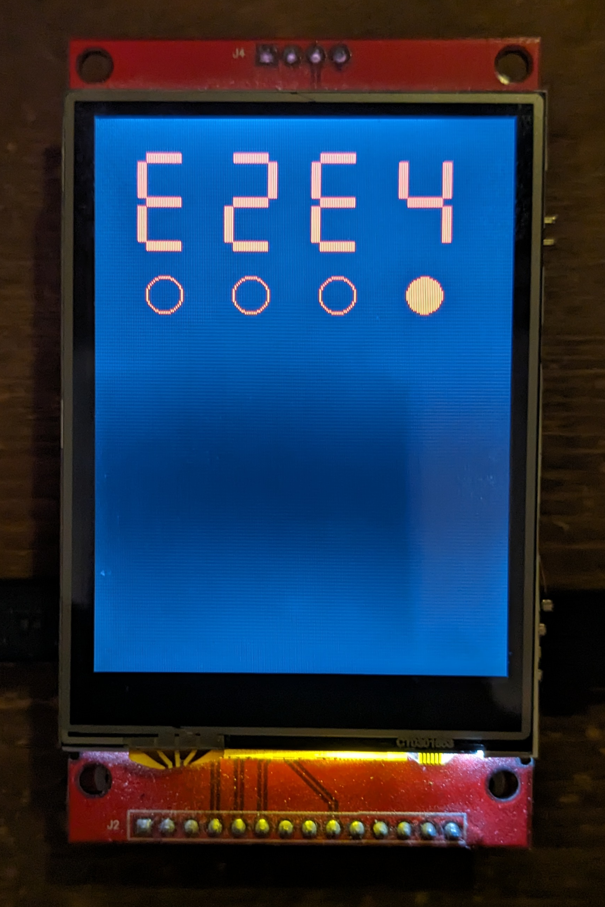

# Commodore CHESSmate

An emulation of the [Commodore CHESSmate]() based on information from 
[Hans Otten](http://retro.hansotten.nl/6502-sbc/6530-6532/chessmate/).

Inspired by an article on [Hackaday](https://hackaday.com/2023/11/14/the-quaint-history-of-the-commodore-chessmate/)!

